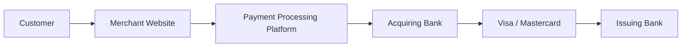

# C4 - Context Diagram

```mermaid
flowchart LR

Customer["Customer"]

Merchant["Merchant Website"]

System["Payment Processing Platform"]

Acquirer["Acquiring Bank"]

Network["Visa / Mastercard"]

Issuer["Issuing Bank"]

Customer --> Merchant

Merchant --> System

System --> Acquirer

Acquirer --> Network

Network --> Issuer
```
