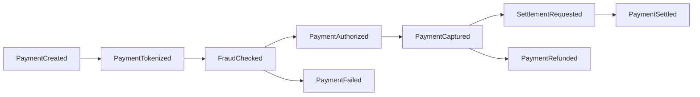

# Payment Event Flow

```mermaid
flowchart LR
    PaymentCreated["PaymentCreated"]
    PaymentTokenized["PaymentTokenized"]
    FraudChecked["FraudChecked"]
    PaymentAuthorized["PaymentAuthorized"]
    PaymentCaptured["PaymentCaptured"]
    SettlementRequested["SettlementRequested"]
    PaymentSettled["PaymentSettled"]
    PaymentFailed["PaymentFailed"]
    PaymentRefunded["PaymentRefunded"]

    PaymentCreated --> PaymentTokenized
    PaymentTokenized --> FraudChecked
    FraudChecked --> PaymentAuthorized
    FraudChecked --> PaymentFailed
    PaymentAuthorized --> PaymentCaptured
    PaymentCaptured --> SettlementRequested
    SettlementRequested --> PaymentSettled
    PaymentCaptured --> PaymentRefunded
```
