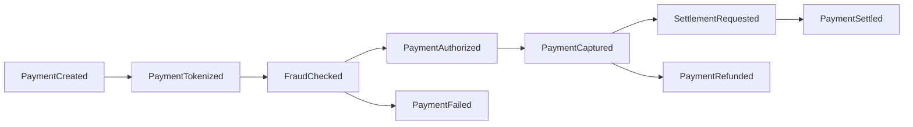

# Payment Event Flow

## Eventos principales

| Evento | Productor | Consumidores |
|---|---|---|
| PaymentCreated | Payment Journey Service | Fraud Service, Payment Service |
| FraudChecked | Fraud Service | Payment Journey Service |
| PaymentAuthorized | Payment Service | Settlement Service, Notification Service |
| PaymentCaptured | Payment Service | Settlement Service |
| PaymentSettled | Settlement Service | Backoffice, Notification Service |
| PaymentRefunded | Payment Service | Notification Service, Backoffice |
