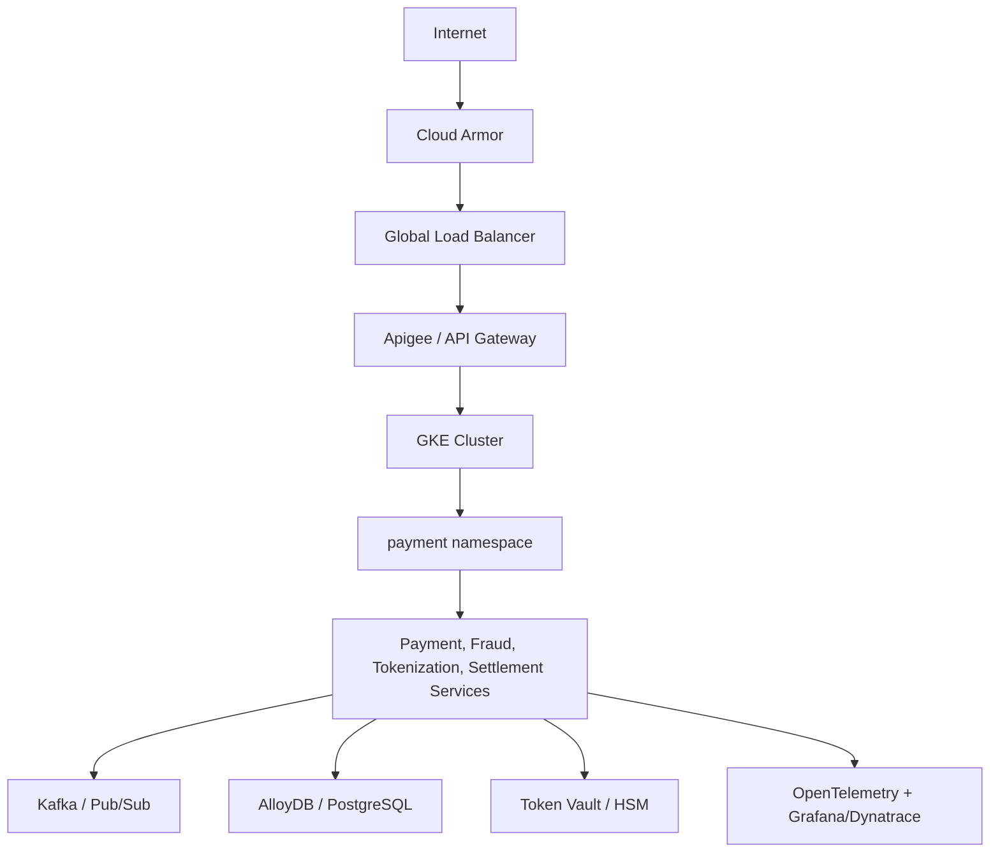

# GCP Infrastructure Topology

```mermaid
flowchart TB
    Internet["Internet"]
    CloudArmor["Cloud Armor"]
    LoadBalancer["Global Load Balancer"]
    Apigee["Apigee / API Gateway"]
    GKE["GKE Cluster"]
    PaymentNS["payment namespace"]
    Services["Payment, Fraud, Tokenization, Settlement Services"]
    EventBus["Kafka / Pub/Sub"]
    DB["AlloyDB / PostgreSQL"]
    Vault["Token Vault / HSM"]
    Observability["OpenTelemetry + Grafana/Dynatrace"]

    Internet --> CloudArmor
    CloudArmor --> LoadBalancer
    LoadBalancer --> Apigee
    Apigee --> GKE
    GKE --> PaymentNS
    PaymentNS --> Services
    Services --> EventBus
    Services --> DB
    Services --> Vault
    Services --> Observability
```
