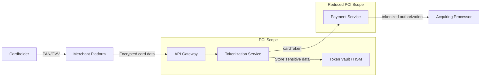

# PCI DSS Data Flow

```mermaid
flowchart LR
    Cardholder["Cardholder"]
    Merchant["Merchant Platform"]
    Gateway["API Gateway"]
    Tokenization["Tokenization Service"]
    Vault["Token Vault / HSM"]
    Payment["Payment Service"]
    Acquirer["Acquiring Processor"]

    Cardholder -->|PAN/CVV| Merchant
    Merchant -->|Encrypted card data| Gateway
    Gateway --> Tokenization
    Tokenization -->|Store sensitive data| Vault
    Tokenization -->|cardToken| Payment
    Payment -->|tokenized authorization| Acquirer

    subgraph PCI["PCI Scope"]
        Gateway
        Tokenization
        Vault
    end

    subgraph ReducedScope["Reduced PCI Scope"]
        Payment
    end
```
