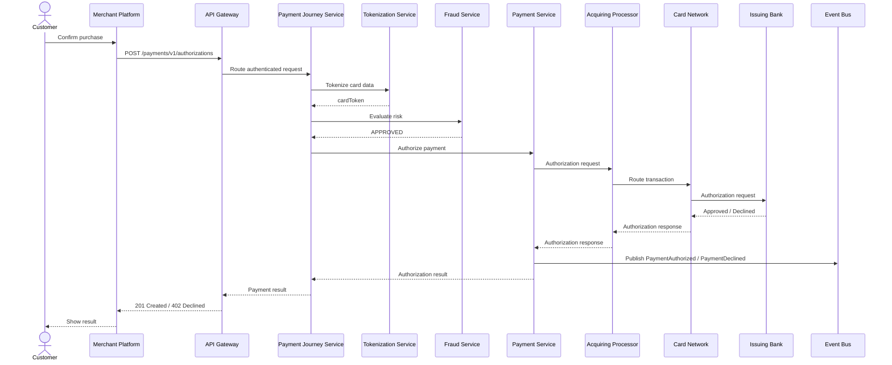

# UML - Payment Authorization Sequence

```mermaid
sequenceDiagram
    actor Customer
    participant Merchant as Merchant Platform
    participant Gateway as API Gateway
    participant Journey as Payment Journey Service
    participant Tokenization as Tokenization Service
    participant Fraud as Fraud Service
    participant Payment as Payment Service
    participant Acquirer as Acquiring Processor
    participant Network as Card Network
    participant Issuer as Issuing Bank
    participant EventBus as Event Bus

    Customer->>Merchant: Confirm purchase
    Merchant->>Gateway: POST /payments/v1/authorizations
    Gateway->>Journey: Route authenticated request
    Journey->>Tokenization: Tokenize card data
    Tokenization-->>Journey: cardToken
    Journey->>Fraud: Evaluate risk
    Fraud-->>Journey: APPROVED
    Journey->>Payment: Authorize payment
    Payment->>Acquirer: Authorization request
    Acquirer->>Network: Route transaction
    Network->>Issuer: Authorization request
    Issuer-->>Network: Approved / Declined
    Network-->>Acquirer: Authorization response
    Acquirer-->>Payment: Authorization response
    Payment->>EventBus: Publish PaymentAuthorized / PaymentDeclined
    Payment-->>Journey: Authorization result
    Journey-->>Gateway: Payment result
    Gateway-->>Merchant: 201 Created / 402 Declined
    Merchant-->>Customer: Show result
```
