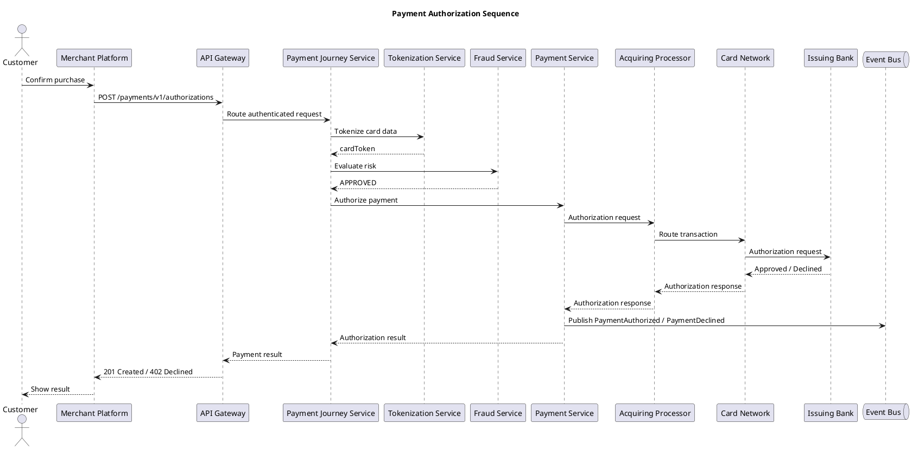

# UML - Payment Authorization Sequence

```plantuml
@startuml
title Payment Authorization Sequence

actor Customer
participant "Merchant Platform" as Merchant
participant "API Gateway" as Gateway
participant "Payment Journey Service" as Journey
participant "Tokenization Service" as Tokenization
participant "Fraud Service" as Fraud
participant "Payment Service" as Payment
participant "Acquiring Processor" as Acquirer
participant "Card Network" as Network
participant "Issuing Bank" as Issuer
queue "Event Bus" as EventBus

Customer -> Merchant : Confirm purchase
Merchant -> Gateway : POST /payments/v1/authorizations
Gateway -> Journey : Route authenticated request
Journey -> Tokenization : Tokenize card data
Tokenization --> Journey : cardToken
Journey -> Fraud : Evaluate risk
Fraud --> Journey : APPROVED
Journey -> Payment : Authorize payment
Payment -> Acquirer : Authorization request
Acquirer -> Network : Route transaction
Network -> Issuer : Authorization request
Issuer --> Network : Approved / Declined
Network --> Acquirer : Authorization response
Acquirer --> Payment : Authorization response
Payment -> EventBus : Publish PaymentAuthorized / PaymentDeclined
Payment --> Journey : Authorization result
Journey --> Gateway : Payment result
Gateway --> Merchant : 201 Created / 402 Declined
Merchant --> Customer : Show result

@enduml
```
